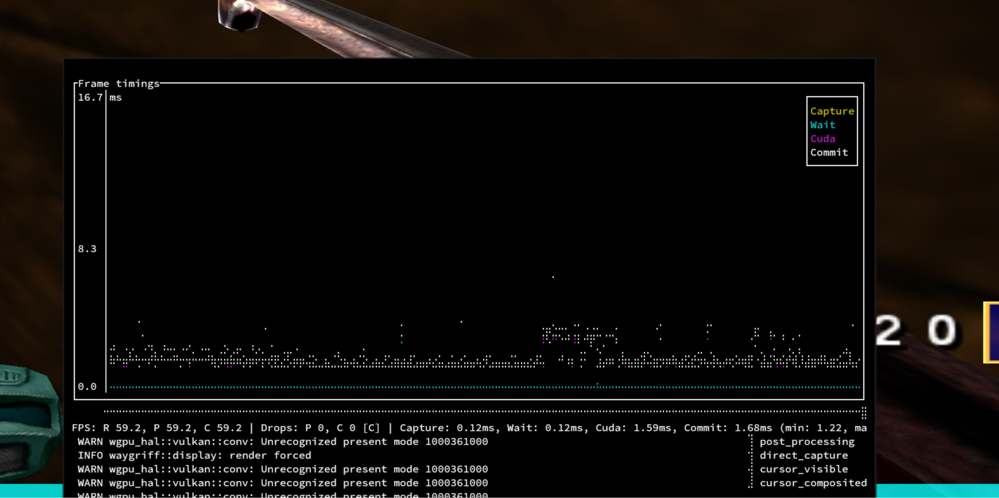

waygriff is a local display proxy.
It captures frames from an X11 session and displays them in a Wayland window on the same computer.
Mouse and keyboard inputs are forwarded in the other direction.

This is personal infrastructure, not a product.
I'm publishing it for entertainment purposes.

## why

I switched my PC's desktop session from the Nvidia card to the Ryzen iGPU to save on power costs and free up VRAM for ML stuff. Games use PRIME offload for rendering, like on a laptop.
Unfortunately, Mesa's Wayland Vulkan WSI is even jankier than Nvidia's.

- Mouse is not grabbed reliably.
  Depending on moon phase and Proton version, the pointer isn't confined at all or requires opening and closing the game menu.
- Floating game windows consistently pick the portrait 1440x2560 resolution from one of my side monitors regardless of xrandr --primary setting.
- Fullscreen doesn't work, whether initiated by Hyprland or the game.
  The window un-fullscreens itself immediately.

## why not

- **gamescope**? Fails with some DRM modifier nonsense. Valve maintains gamescope for the Steam Deck and it never worked right when an Nvidia card is involved.
- **Rootful Xwayland**? Needs patches to filter RandR resolutions, use real refresh rate instead of hardcoded 60, ignore inputs outside of grab mode, show visual indicator of lost focus, override grab shortcut. I don't want to carry a large patch set in my system flake.

## shortcuts

- Super+Escape toggles input grab
- Super+R forces relative mouse mode
- Super+C toggles capture mode (when I switch monitor inputs and only use this to forward keyboard and mouse)

## fun features!

- spiffy TUI shows frame timings
- primary clipboard and selection sync
- color border with a breathing effect to indicate ungrabbed state
- absolute coordinate mouse events when the cursor is visible
- pillarbox/letterbox when the window aspect ratio doesn't match source display (wasted a lot of time on a useless feature award)

## GPU facts I learned

- The CUDA buffer produced by an NVFBC capture is only valid until the next capture call.
  This means the data has to be copied synchronously.
- CUDA device-to-device memcpy is always asynchronous even if you call the non-Async variant.
  A subsequent stream sync does wait for it
- It is not possible to export an Nvidia VRAM buffer to DMA-BUF and send it to the iGPU.
- There is no sane way to expose a CUDA buffer as a DMA-BUF on PC.
  [A wizard managed to do it with private ioctls](https://forums.developer.nvidia.com/t/cuda-and-linux-dma-buf/194267/4).
  When the compositor tries to import the buffer, the amdgpu driver asks the nvidia driver to map the buffer to a virtual address and nvidia driver refuses.
  No idea whose fault this is!
- Despite looking like a perfect fit, Wayland's [linux-drm-syncobj-v1](https://wayland.app/protocols/linux-drm-syncobj-v1) protocol and Vulkan's timeline semaphores are not compatible.
  There's a Vulkan [spec bug](https://github.com/KhronosGroup/Vulkan-Docs/issues/2473) about it.
- NVFBC blocking capture is very inconsistent. In windowed mode, it randomly delivers a new frame after 250-700us, perhaps because the desktop environment's clock changes and emits a damage event.
  - In full screen mode, it oscillates between 95 and 115 Hz on a 120 Hz display.
- NVIDIA Vulkan WSI for Wayland implements vkWaitForPresentKHR by polling the server in a tight loop

## code index

- [display thread](./src/display/mod.rs). Wayland window boilerplate.
  Dispatches frame and resize events to capture thread.
- [input](./src/display/input.rs). Input event forwarding.
- [capture thread](./src/capture/mod.rs). Renders captured frames onto Vulkan swapchain. Cool breathing border effect when input capture is disabled.
- [nvfbc](./src/capture/backend/nvfbc/mod.rs). NVFBC capture backend.
- [plotter](./src/capture/plotter.rs). TUI with frame timing charts.
